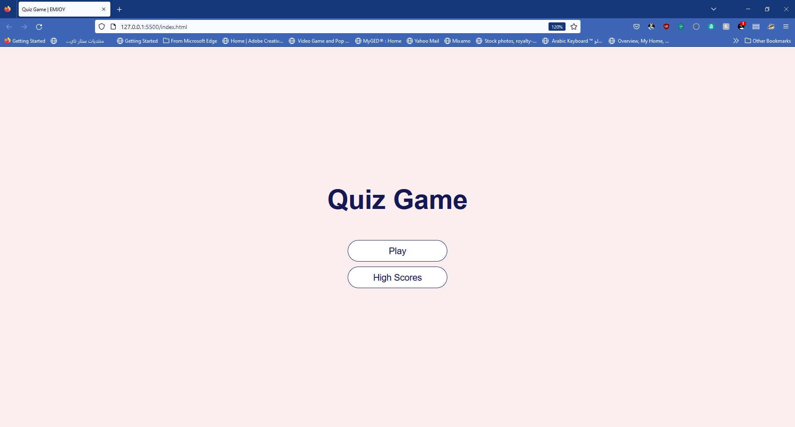
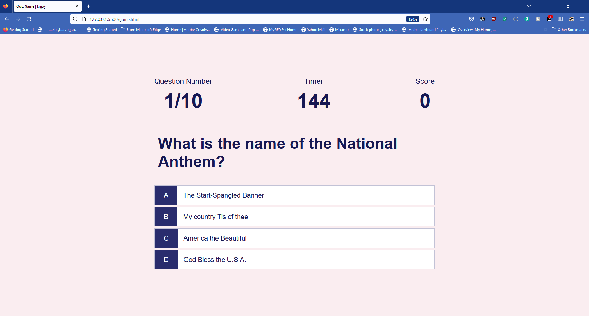
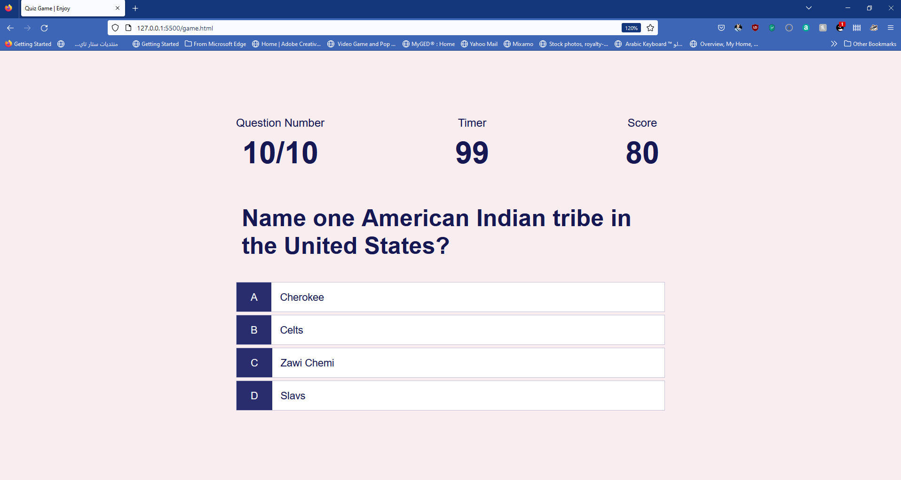
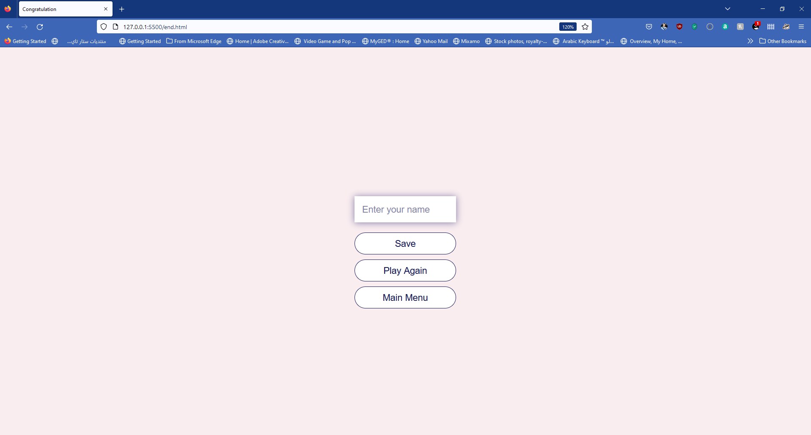
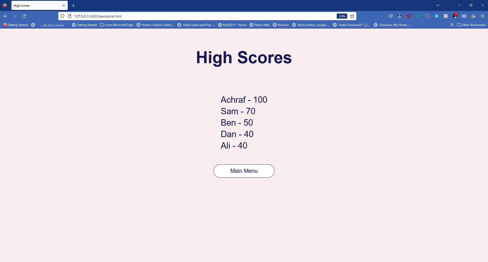
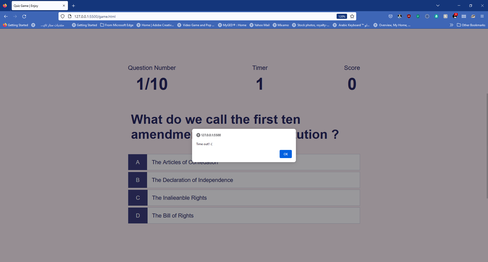

# 04-Quiz-Game
A Multiple-choices Quiz Game about the United States (civic), buit with HTML,CSS, nad JavaScript. 

<h2>The challange </h2>
Challenge requires you to create a Quiz Game with Timer and multiple-choices, and at the end of the game player can enter his initial to save the score before resetting and starting over.

## User Story

```
AS A coding boot camp student
I WANT to take a timed quiz on JavaScript fundamentals that stores high scores
SO THAT I can gauge my progress compared to my peers
```

## Acceptance Criteria

```
GIVEN I am taking a code quiz
WHEN I click the start button
THEN a timer starts and I am presented with a question
WHEN I answer a question
THEN I am presented with another question
WHEN I answer a question incorrectly
THEN time is subtracted from the clock
WHEN all questions are answered or the timer reaches 0
THEN the game is over
WHEN the game is over
THEN I can save my initials and my score
```

## The Application screenshots:
```
At the end I was able to create an efficient and responsive quiz application using the described process, 
which displayed questions, a Timer, and a multipale-choices. the player can also enter his initial to save
the score before restting and resetarting over.
```

<br>
<br>

<br>

<br>

<br>

<br>

<br>


## The Resources I used:

- https://stackoverflow.com/
- https://www.w3schools.com/jsref/event_onclick.asp
- https://favicon.io/favicon-generator/
- https://colorhunt.co/palettes/cold

## Links to the challange
<br>
The challange was upload to Github at the following repository:
<br>

GitHub Repo: 
- https://github.com/Ash0422/04-Quiz-Game

 deployed application: 
- https://ash0422.github.io/04-Quiz-Game/